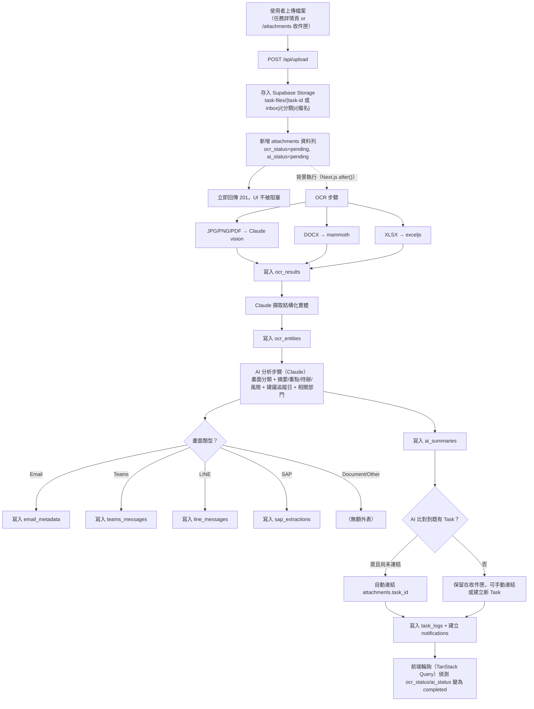
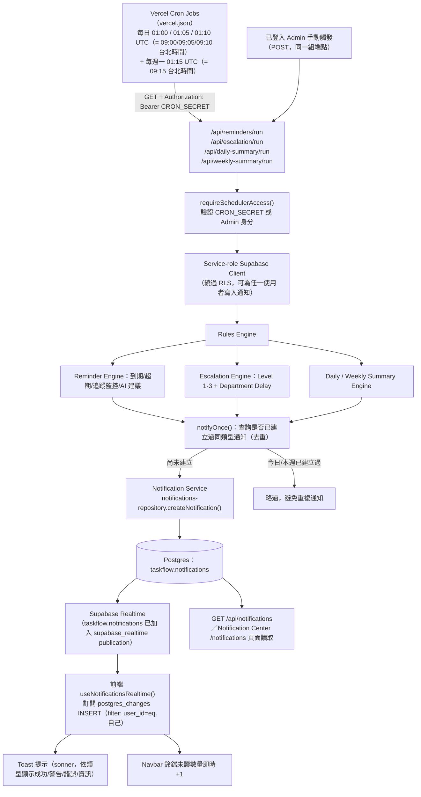
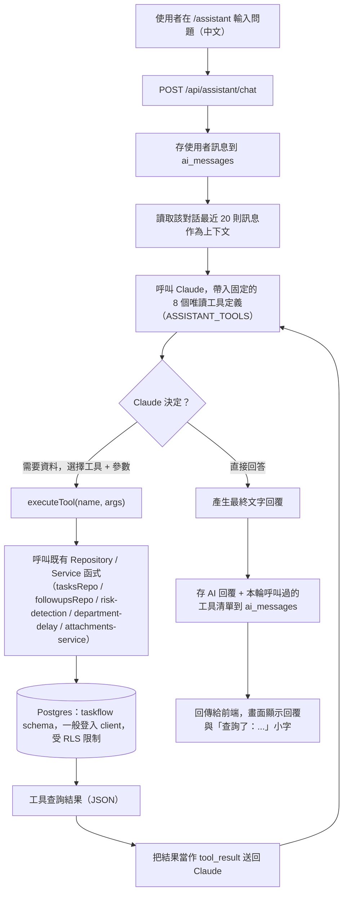

# TaskFlow — AI 工作追蹤與跨部門協作系統 V1

企業級工作待辦管理與跨部門協作系統。Next.js 15 (App Router) + Supabase + PostgreSQL，Mobile First、支援深色/淺色模式，跨 Windows / Mac / iPhone / Android / iPad 即時同步。

本專案逐步交付，目前已完成 **Phase 1：Database + Auth + Dashboard**、**Phase 2：Task Management + Kanban Board**、**Phase 3：Attachment + OCR + AI Document Intelligence**、**Phase 4：Notification Center + Reminder Engine + Escalation System**、**Phase 6：AI Assistant + Knowledge Engine + Natural Language Query** 與 **Phase 6.5：Aviation Planning Operations Center**（詳見下方「開發階段」；Phase 5 尚未收到需求規格）。系統不再只是記錄任務——每天 09:00 會主動掃描到期/超期/未追蹤事項並推播通知，也能直接用中文問「今天有哪些待辦」「哪些任務超期」「KHH 專案進度如何」由內建 AI 助理即時查詢正式資料庫回答。**Phase 6.5 將系統定位修正為航空維修 Planning 部門的營運中心**：新首頁 `/planning` 整合每日檢查清單、跨部門等待回覆、主管交辦、專案（RMQ/KHH）、月度規劃時間軸與 AI 每日簡報，任務也新增機型/機號/基地/工作類別等航空維修專屬欄位。

## 技術架構

| 分類 | 技術 |
|---|---|
| Frontend | Next.js 15 (App Router) · TypeScript · Tailwind CSS v4 · shadcn/ui 風格元件 · React Hook Form · Zod · TanStack Query · @dnd-kit · sonner（Toast） |
| Backend / DB | Supabase (Postgres 17, Auth, Storage, **Realtime**) |
| AI / OCR | Anthropic Claude API（`@anthropic-ai/sdk`，vision 模型讀取截圖/PDF + 文字分析、Smart Follow-up 建議、**AI 助理對話 + 工具呼叫（Tool Use）+ 風險評分 + 報告生成**）· mammoth（DOCX 文字擷取）· exceljs（XLSX 文字擷取）· pgvector（Phase 6：語意搜尋用的向量欄位，已建立但**尚未接上 Embedding 供應商**，見「開發階段」Phase 6 說明） |
| 圖表 | Recharts |
| 排程 | Vercel Cron Jobs（`vercel.json`）驅動 Reminder / Escalation / Daily·Weekly Summary 引擎 |
| Deployment | Vercel |

### 為什麼有一個獨立的 `taskflow` schema？

這個 Supabase 專案（`naomi19174@gmail.com's Project`）原本已經在跑「股票收益小幫手」，資料表都在 `public` schema。為了不互相干擾，本系統的所有資料表、函式、觸發器都建立在獨立的 **`taskflow` schema**，並透過 PostgREST 設定同時對外公開 `public` 與 `taskflow` 兩個 schema。兩個系統共用同一組 Supabase 專案，但資料完全隔離。

## 專案結構

```
src/
  app/
    (auth)/login/                登入 / 註冊
    (app)/dashboard/             儀表板（Phase 1）
    (app)/tasks/                 任務列表（Phase 2）— page.tsx（metadata）+ tasks-client.tsx
    (app)/tasks/[id]/            任務詳情（Phase 2）— 任務資訊、附件/AI摘要佔位、追蹤紀錄、異動時間軸
    (app)/kanban/                看板（Phase 2）— @dnd-kit 拖曳，6 個狀態欄位
    (app)/search/                搜尋中心（Phase 2）— 全域搜尋 + 常用篩選條件
    (app)/departments/           部門管理 — Department Workload Widget（任務數/完成率/超期數）
    (app)/attachments/           附件與 OCR（Phase 3）— page.tsx + attachments-client.tsx，
                                  文件智慧收件匣（未連結任務的附件、篩選、上傳）
    (app)/calendar/              行事曆（未來 Phase 佔位頁）
    (app)/notifications/         通知中心（Phase 4）— page.tsx + notifications-client.tsx，
                                  全部/未讀/已讀分頁、類型篩選、搜尋、全部已讀、Manager/Admin 可切換
                                  「只看我的通知」
    (app)/assistant/             AI 助理（Phase 6）— page.tsx + assistant-client.tsx，
                                  ChatGPT/Claude 風格對話介面（對話清單側欄、訊息氣泡、建議問題 chips、
                                  輸入框），支援 `?q=` 帶入問題並自動送出（供 Dashboard Widget 快速連結）
    (app)/settings/              個人設定 + 通知設定（Phase 4：Email/站內/Push/每日摘要/每週摘要開關）
    (app)/planning/              Planning Operations Center（Phase 6.5）— page.tsx + planning-client.tsx，
                                  系統主要首頁：Today/Weekly/Monthly/Projects/Waiting/Supervisor/
                                  AI Briefing 七大區塊 + Planning KPI 卡片列
    api/
      tasks/route.ts             GET（列表+篩選+搜尋+分頁+排序）/ POST（新增）
      tasks/[id]/route.ts        GET / PATCH / DELETE（軟刪除）
      followups/route.ts         GET（依 task_id）/ POST（新增追蹤紀錄）
      search/route.ts            GET（跨 task number/title/description/department/owner 搜尋）
      saved-filters/route.ts     GET / POST
      saved-filters/[id]/route.ts DELETE
      upload/route.ts            POST（Phase 3：上傳檔案 → 存 Storage → 建立 attachments 列 → 背景觸發 OCR/AI）
      attachments/route.ts       GET（列表，依 task_id / inbox / 分類 / 狀態 / 檔名搜尋 篩選）
      attachments/[id]/route.ts  GET / DELETE
      attachments/[id]/url/route.ts   GET（短效 Signed URL，供預覽/下載）
      attachments/[id]/link/route.ts  POST（連結/建立新 Task 後回填 task_id）
      attachments/stats/route.ts GET（Dashboard 文件智慧統計）
      ocr/route.ts                POST（重新觸發 OCR，attachment_id）
      ai-analysis/route.ts        POST（重新觸發 AI 分析，attachment_id）
      ocr-results/route.ts        GET（依 attachment_id 取 OCR 結果）
      ai-summaries/route.ts       GET（依 attachment_id 或 task_id 取 AI 摘要）
      document-search/route.ts    GET（跨 OCR 文字/AI摘要/檔名/Email/Teams/LINE 內容搜尋）
      notifications/route.ts      GET（列表，type/is_read/搜尋/分頁 + mine 切換，含 unreadCount）
      notifications/read/route.ts PATCH（單筆已讀/未讀，或 `{all:true}` 全部已讀）
      notifications/[id]/route.ts DELETE
      notification-settings/route.ts  GET / PATCH（Email/站內/Push/每日/每週摘要開關）
      reminders/run/route.ts      GET+POST（Reminder + Overdue + Follow-up Monitoring + AI 建議，
                                    Vercel Cron 或 Admin 手動觸發，見 scheduler-auth.ts）
      escalation/run/route.ts     GET+POST（Escalation Level 1-3 + Department Delay 通知）
      daily-summary/route.ts      GET（即時計算，登入者個人視角；Admin 可加 `?scope=org`）
      daily-summary/run/route.ts  GET+POST（排程：每位訂閱使用者各發一則每日摘要通知）
      weekly-summary/route.ts     GET（即時計算，同上）
      weekly-summary/run/route.ts GET+POST（排程：每位訂閱使用者各發一則每週摘要通知）
      assistant/chat/route.ts     POST（Phase 6：AI 對話一輪——存使用者訊息、跑 Claude tool-use
                                    迴圈、存並回傳 AI 回覆）
      assistant/history/route.ts  GET（無 `conversation_id` 回對話清單；帶 `conversation_id` 回該對話訊息）
      assistant/report/route.ts   POST（Phase 6：`{type: daily|weekly|monthly|project|department}` →
                                    對應報告，含 AI 生成的重點摘要段落）
      assistant/search/route.ts   POST（Phase 6：語意搜尋尚未設定 Embedding 供應商，優雅退回關鍵字搜尋
                                    並在回應中標示 `semantic_search_configured: false`）
      planning/fleet/route.ts     GET（依 aircraft_type 篩選）/ POST（Manager/Admin，新增機隊主檔）
      planning/projects/route.ts  GET（Project Center 彙總）/ POST（Manager/Admin，新增專案）
      planning/projects/[id]/milestones/route.ts  POST（新增里程碑）
      planning/milestones/[id]/route.ts  PATCH（切換里程碑完成狀態）
      planning/checklist/route.ts GET（今日或 `?date=` 指定日期的每日檢查清單）
      planning/checklist/history/route.ts  GET（歷史紀錄）
      planning/checklist/run/route.ts      GET+POST（00:00 排程：建立當日清單 + 執行 Recurring Task Engine）
      planning/checklist-items/[id]/route.ts  PATCH（勾選完成/備註）
      planning/waiting/route.ts   GET（依狀態/等待單位篩選）/ POST（新增等待事項）
      planning/waiting/[id]/route.ts  GET / PATCH / DELETE（Admin）
      planning/waiting/[id]/derive-task/route.ts  POST（Derived Task Engine：由等待事項建立 Child Task
                                    並標記已回覆）
      planning/follow-ups/route.ts  GET（依 entity_type + entity_id）/ POST（新增追蹤紀錄）
      planning/supervisor-tasks/route.ts  GET / POST
      planning/supervisor-tasks/[id]/route.ts  GET / PATCH
      planning/recurring-templates/route.ts  GET / POST（Manager/Admin）
      planning/briefing/route.ts  GET（即時計算的 Daily AI Briefing）
      planning/briefing/run/route.ts  GET+POST（08:00 排程：產生簡報 + 發送 daily_summary 通知）
      planning/kpi/route.ts       GET（Planning KPI）
      planning/analytics/route.ts GET（Analytics Enhancement：機型/基地/工作類別工作量）
  components/
    ui/           基礎元件（button, card, table, dialog, select, tabs, sheet, switch...）
    tasks/        任務相關元件：task-table / task-form-dialog / task-filters-bar /
                  multi-select-filter / task-badges（優先級/狀態/Smart Follow-up 指示燈）/
                  followup-timeline / add-followup-dialog / activity-timeline /
                  saved-filters-panel / search-result-row
    kanban/       kanban-board / kanban-column / kanban-card（@dnd-kit 拖曳 + 快速動作選單）
    attachments/  Phase 3：upload-dropzone（拖曳多檔上傳）/ attachment-list（列表 + 狀態徽章）/
                  attachment-detail-sheet（OCR 原文、AI 摘要、擷取實體、Email/Teams/LINE/SAP 專屬區塊、
                  連結任務或建立新 Task）/ attachment-badges / document-search-results
    notifications/  Phase 4：notification-list（類型圖示、已讀/未讀、標記已讀、刪除，
                    有關聯任務時點擊可直接跳轉）
    layout/       側邊欄、頂欄（含 notification-bell：即時未讀數量徽章 + Realtime 訂閱）、
                  使用者選單、Coming Soon 元件
    dashboard/    統計卡片、4 個既有圖表元件、department-delay-table（Phase 4：Top Delay Departments）、
                  ai-assistant-widget（Phase 6：3 個快速問題 chips，連到 /assistant?q=... 並自動送出）
    planning/     Phase 6.5：today-center / weekly-center / planning-timeline / projects-center /
                  waiting-center / supervisor-center / ai-briefing-center / planning-kpi-cards
                  （七大區塊 + KPI 卡片，皆為獨立可重用元件，/planning 頁面直接組合）
    confirm-dialog.tsx  通用刪除/危險操作確認視窗
  hooks/          use-tasks / use-followups / use-task-logs / use-lookups（含 Phase 6.5：
                  useFleet、useProjectOptions，供任務表單 Aircraft Type → Registration 級聯與
                  Project 下拉使用）/
                  use-search / use-saved-filters / use-debounced-value /
                  use-attachments（Phase 3：列表/上傳/刪除/重試 OCR·AI/連結任務/文件搜尋/儀表板統計，
                  處理中狀態會自動輪詢直到 OCR/AI 完成）
                  use-notifications（Phase 4：列表/未讀數量/標記已讀/全部已讀/刪除/通知設定，
                  + useNotificationsRealtime 訂閱 Supabase Realtime 並跳 Toast）
                  use-assistant（Phase 6：對話清單/單一對話訊息/送出訊息/報告生成/語意搜尋）
                  use-planning（Phase 6.5：Today/Weekly/Waiting/Supervisor/Projects/KPI/Analytics/
                  Briefing 各區塊的查詢與變更 mutation，供 /planning 首頁元件使用）
                  （TanStack Query 包裝 API 呼叫；lookups 直接查 Supabase，走既有 RLS）
  lib/
    ai/anthropic-client.ts  Claude client 建構、JSON 擷取工具、AiNotConfiguredError（金鑰未設定時
                        優雅失敗，附件會標記為 failed 並附上錯誤訊息，不會擋住上傳流程）
    storage/attachments.ts  Supabase Storage 存取（上傳/下載/刪除/Signed URL）、路徑規則
    supabase/          瀏覽器 / 伺服器 / middleware 三種 Supabase client，
                        + service.ts（Phase 4：Service-role client，僅供排程引擎在伺服器端
                        為「其他使用者」寫入通知，繞過 RLS；絕不曝露給瀏覽器）
    scheduler-auth.ts  Phase 4：`/api/*/run` 端點的存取檢查（Vercel Cron 的 `CRON_SECRET` bearer token，
                        或已登入的 Admin 手動觸發）
    repositories/      Repository 層（純資料存取，無商業邏輯）：
                        tasks / followups / task-logs / saved-filters / lookups /
                        attachments / ocr / ai-summaries /
                        notifications（Phase 3 建立，Phase 4 擴充：角色可視範圍、已讀/未讀、
                        排程引擎去重查詢）/ notification-settings（Phase 4 新增）/
                        conversations（Phase 6 新增：ai_conversations/ai_messages 存取，
                        RLS 已限定僅本人可讀寫，故只需一般登入 client 即可）/
                        Phase 6.5 新增：planning-lookups（Fleet Master/Project Center/
                        Recurring Task Engine 範本 CRUD）、checklist-repository（Daily Checklist
                        冪等建立/查詢/勾選）、waiting-repository、follow-up-repository（通用
                        entity_type+entity_id 查詢）、supervisor-repository
    services/          Service 層（權限檢查、Smart Follow-up 計算、跨表搜尋合併、部門工作量彙總）：
                        tasks-service / followups-service / saved-filters-service /
                        departments-service / attachments-service（Phase 3：上傳、OCR/AI 處理管線、
                        文件搜尋、Document Intelligence 統計）
                        ocr-service（Claude vision OCR + mammoth/exceljs 文字擷取 + 實體擷取）
                        ai-service（畫面分類、摘要/重點/待辦/風險、建議追蹤日、Task 自動比對、
                        Email/Teams/LINE/SAP 專屬擷取）
                        notifications-service（Phase 4：列表含未讀數量、已讀/全部已讀、刪除、通知設定）
                        engine-utils（Phase 4：排程引擎共用的 `notifyOnce` 去重寫入、時間輔助函式）
                        reminder-engine（Phase 4：到期提醒 + 超期分級 + 追蹤監控 7/14/30 天 +
                        AI Smart Follow-up 建議，四步驟合併為單次每日掃描）
                        escalation-engine（Phase 4：Level 1/2/3 升級 + 觸發 Department Delay 通知）
                        department-delay（Phase 4：各部門平均回覆/結案天數、超期率彙總）
                        daily-summary / weekly-summary（Phase 4：雙模式——即時計算個人視角 +
                        排程產生訂閱摘要通知）
                        assistant-tools（Phase 6：AI 助理可呼叫的 8 個唯讀查詢工具，Phase 6.5 再新增
                        5 個 Planning 專屬工具、共 13 個——見「AI 助理架構」說明，刻意不讓 AI 產生並
                        執行原始 SQL）
                        risk-detection（Phase 6：規則式 0-100 風險分數，非 AI 猜測——超期天數 +
                        無更新天數 + 跨部門追蹤數 + 重複追蹤次數，加權後 clamp 到 100）
                        assistant-service（Phase 6：AI 對話主邏輯——Claude tool-use 迴圈、
                        對話記憶讀寫、自動產生對話標題）
                        report-generator（Phase 6：日/週/月/專案/部門報告，重用 Phase 4 的
                        daily-summary/weekly-summary 引擎，並用 Claude 產生 2-4 句重點摘要，
                        AI 未設定或呼叫失敗時優雅退回純數字模板句子）
                        Phase 6.5 新增：project-service（Project Center 彙總，風險指數重用
                        risk-detection）、checklist-service、waiting-service（等待天數/顏色計算 +
                        Derived Task Engine 的 createDerivedTask）、follow-up-service（含
                        runFollowUpDueEngine，併入 reminder-engine 每日執行）、supervisor-service、
                        recurring-task-engine（Daily/Weekly/Monthly/Quarterly/Yearly 判斷 + 產生
                        `tasks` 列）、daily-briefing（Daily AI Briefing 計算 + 排程通知）、
                        planning-kpi-service（Planning KPI + Analytics Enhancement）
    validations/       Zod schema：task.ts（表單 + 查詢參數，Phase 6.5 擴充機型/基地/工作類別等欄位）、
                        followup.ts（追蹤紀錄 + 篩選）、
                        attachment.ts（上傳/查詢/OCR·AI 觸發/連結任務/文件搜尋，Phase 3 新增）、
                        notification.ts（Phase 4：查詢/已讀/通知設定）、
                        assistant.ts（Phase 6：聊天訊息、歷史查詢、報告請求（discriminated union）、
                        搜尋請求）、
                        planning.ts（Phase 6.5：Fleet Master/Project/Milestone/Checklist Item/
                        Waiting Item/Follow-up Record/Supervisor Task/Recurring Template schema）
    errors.ts          共用錯誤類別（PermissionError / UnauthorizedError），所有 service 共用同一份
    smart-followup.ts  Smart Follow-up Indicator 計算（0-3天綠/4-7天黃/8天以上紅）
    api-utils.ts       API 路由共用：登入檢查、錯誤轉 HTTP 狀態碼、查詢參數解析
    auth.ts            取得目前登入使用者（含角色）
    dashboard-queries.ts  儀表板資料查詢與彙總（含 Phase 3 Document Intelligence 統計；
                        Phase 4：Notification Widget、平均回覆/結案天數 KPI、Top Delay Departments）
    constants.ts       狀態 / 優先級 / 角色的中文標籤與樣式對應、看板欄位、常用篩選預設、
                        Phase 3：附件分類、畫面類型、處理狀態標籤、允許的檔案類型、大小上限、
                        Phase 4：通知類型標籤/徽章樣式、升級層級（7/14/30天）、追蹤監控門檻、到期提醒區間
  types/
    database.types.ts  對應 `taskflow` schema 的手寫型別
    domain.ts          API / UI 用的組合型別（TaskWithRelations、SmartFollowupState、
                        AttachmentWithRelations、AiAnalysisResult、DocumentSearchResult、
                        Phase 4：NotificationWithTask、NotificationsListResponse、DepartmentDelay、
                        DailySummary、WeeklySummary、EngineRunResult；
                        Phase 6：ChatMessage、ConversationSummary、ChatResponse、TaskRiskScore、
                        ProjectStatusReport、DepartmentReport、MonthlyReport、AssistantReport 等；
                        Phase 6.5：FleetAircraft、ProjectSummary、DailyChecklistWithItems、
                        WaitingItemWithTask、FollowUpRecordWithAuthor、SupervisorTaskWithUsers、
                        RecurringTaskTemplate、PlanningBriefing、PlanningKpis、PlanningAnalytics）
supabase/
  migrations/     Phase 1：schema/function-trigger-RLS/seed；
                  Phase 2：tags+軟刪除+saved_filters、部門管理者資料表更新、部門管理者 RLS 範圍限縮、
                  RLS 效能優化、created_by 索引，以及 3 份測試資料 seed；
                  Phase 3：task-files Storage bucket + RLS、attachments 擴充（ocr_status/ai_status/
                  screen_type/category/matched_task_id/version，task_id 改為可為 NULL）、
                  新增 ocr_results / ocr_entities / email_metadata / teams_messages / line_messages /
                  sap_extractions、ai_summaries 擴充（attachment_id/risk_items/action_items/
                  suggested_followup_date/departments）、索引與 RLS 優化；
                  Phase 4：notifications 欄位改名對齊規格（task_id→related_task_id、body→message、
                  read_at→is_read）+ 11 種通知類型 + 角色可視範圍 RLS（User 自己 / Manager 部門 /
                  Admin 全部）、新增 notification_settings（含新使用者自動建立預設值的觸發器）、
                  taskflow.notifications 加入 supabase_realtime publication、補上 task_logs 的
                  INSERT RLS 政策（Phase 3 遺漏，一併修正）；
                  Phase 6：啟用 `vector`（pgvector）extension、新增 ai_conversations / ai_messages
                  （僅本人可讀寫的 RLS）、新增 knowledge_chunks（`embedding` 欄位為不限維度的
                  pgvector 型別，語意搜尋 Embedding 供應商尚未選定前僅作為預留欄位，未寫入資料、
                  未建立向量索引）；
                  Phase 6.5：新增 7 個 enum type（機型/基地/工作類別/規劃狀態/影響等級/週期頻率/
                  跨部門單位）、9 張新資料表（fleet_master/projects/project_milestones/
                  recurring_task_templates/daily_checklists/daily_checklist_items/waiting_items/
                  follow_up_records/supervisor_tasks，皆含 RLS）、tasks 新增 11 個規劃欄位 + 3 個
                  外鍵（aircraft_registration→fleet_master、parent_task_id 自我參照、
                  project_id→projects、source_template_id→recurring_task_templates）、
                  attachments 新增 checklist_item_id 外鍵、種子 39 筆機隊資料 + 3 個專案 +
                  7 個週期任務範本，以及新增一個 `Planning 計畫組` 部門供範本預設指派
                  （見「開發階段」Phase 6.5 說明）。**這 3 份 migration 是本專案第一次同時把套用到
                  Supabase 的異動也存成本機檔案**——Phase 1-4/6 的異動先前都只透過工具直接套用到
                  正式專案，本機 `supabase/migrations/` 資料夾並未同步保存，是既有的落差、非
                  Phase 6.5 造成，這次未回溯補齊。
vercel.json       Vercel Cron 排程設定（見下方「Scheduler / 排程架構」）
```

## 開發階段（依需求規格）

- [x] **Phase 1：Database + Auth + Dashboard** — 7 張資料表全部建立、RLS、審計 log 觸發器、Email/密碼登入、角色（Admin/Manager/User）、儀表板 6 張統計卡 + 4 張圖表、測試資料已灌入。
- [x] **Phase 2：Task Management + Kanban Board**
  - 任務列表 `/tasks`：表格（編號/標題/優先級/狀態/到期日/追蹤日/最後更新/部門/負責人/Smart Follow-up）、可排序欄位、分頁、即時搜尋、依狀態/優先級/部門/負責人多選篩選、本週到期／超期事項快速篩選。
  - 新增/編輯任務視窗：React Hook Form + Zod 驗證（必填：標題、優先級、部門），支援標籤（tags）。
  - 軟刪除：`deleted_at` 欄位，資料庫觸發器限制只有部門主管或 Admin 能刪除/還原，前端預設查詢會排除已刪除任務。
  - 任務詳情 `/tasks/[id]`：任務資訊、附件與 AI 摘要區塊（真實空狀態 + Phase 3/4 說明，非假畫面）、追蹤紀錄時間軸、異動時間軸（讀自 `task_logs`）。
  - 追蹤紀錄（Follow-up）：新增追蹤紀錄表單（日期/部門/內容/結果/下一步），時間軸最新在最上方，Smart Follow-up Indicator（0-3天綠、4-7天黃、8天以上紅 + "⚠️ Need Follow-up"）。
  - 看板 `/kanban`：@dnd-kit 拖放，6 個狀態欄位（Todo/In Progress/Waiting Response/Pending Approval/Completed/Cancelled），拖曳即寫入資料庫並產生 `task_logs`；卡片快速動作（編輯、開啟詳情、變更優先級、變更到期日）。
  - 搜尋中心 `/search`：跨 Task Number/Title/Description/Department/Owner 全域搜尋（即時顯示）、常用篩選（我的任務/本週到期/高優先級/超期事項）+ 自訂篩選儲存（`saved_filters` 資料表）。
  - 部門管理 `/departments`：Department Workload Widget（任務數/完成率/超期數，即時計算）。
  - API：`GET/POST /api/tasks`、`GET/PATCH/DELETE /api/tasks/:id`、`GET/POST /api/followups`、`GET /api/search`、`GET/POST /api/saved-filters`、`DELETE /api/saved-filters/:id`，皆採 Route Handler → Service 層 → Repository 層架構。
  - 權限：Admin 可操作全部任務；Manager 僅能編輯/刪除自己管理部門的任務；User 僅能編輯自己建立或被指派的任務 — 同時在 Postgres RLS（資料庫層）與 API Service 層各做一次檢查（defense in depth）。
  - 測試資料：50 筆任務（5 部門）、11 位使用者（10 位示範帳號 + 你自己的帳號設為 Admin）、101 筆追蹤紀錄。
- [x] **Phase 3：Attachment + OCR + AI Document Intelligence**
  - 附件管理：任務詳情頁與 `/attachments`（文件智慧收件匣）皆可拖曳上傳（支援多檔）JPG/PNG/PDF/DOCX/XLSX，單檔上限 15MB；下載/預覽（Signed URL，300 秒有效）、刪除（僅上傳者或 Admin）、版本欄位（`version` / `replaces_attachment_id`，供後續版本管理擴充）。
  - Storage：Supabase Storage bucket `task-files`，路徑規則 `{task-id 或 inbox}/{screenshots|documents|emails|teams|line}/{timestamp}-{檔名}`；RLS 限登入使用者存取。
  - 處理管線（Queue System，不阻塞 UI）：上傳 API 立即回應並用 Next.js `after()` 在背景依序執行「OCR → AI 分析 → 寫入資料庫 → 建立通知」；前端以 TanStack Query 輪詢附件狀態直到完成。任一步驟失敗會把 `ocr_status` / `ai_status` 標成 `failed` 並附上錯誤訊息，可在附件詳情面板一鍵重試，其餘附件不受影響。
  - OCR 模組：JPG/PNG/PDF 透過 Claude vision 直接讀取（同時給出語言與信心分數）；DOCX 用 mammoth、XLSX 用 exceljs 直接擷取文字層（不需呼叫 AI）。OCR 結果寫入 `ocr_results`；接著再呼叫 Claude 一次擷取結構化實體（日期/Email/電話/任務編號/部門/截止日/待辦事項）寫入 `ocr_entities`。
  - 截圖智慧：AI 自動判斷畫面類型（Email / Teams / LINE / SAP / Document / Other），並依類型解析出對應的結構化資訊（寄件者/收件者/主旨、Teams 逐則訊息、LINE 群組與訊息、SAP 工單號/料號/機號/工卡/狀態），分別寫入 `email_metadata` / `teams_messages` / `line_messages` / `sap_extractions`。
  - AI 分析模組：Claude 產生摘要、重點、待辦事項、風險項目、建議追蹤日期（依伺服器當日日期推算）、相關部門（僅從系統既有部門挑選），寫入 `ai_summaries`。
  - Task Auto Link：AI 會比對內容是否提及既有任務編號，若附件尚未連結任務且比對到，會自動連結（`attachments.task_id` + `matched_task_id`）；比對不到則在附件詳情面板提供「連結現有任務」或「建立新 Task」（會直接開啟新增任務視窗，建立後自動連結）。
  - 文件搜尋：`/search` 新增「文件搜尋」分頁，跨附件檔名、OCR 全文、AI 摘要、Email/Teams/LINE 內容搜尋，並標示命中來源。
  - Dashboard 新增「文件智慧總覽」：附件數量 / OCR 完成數 / 待分析數 / AI 分析完成數，即時計算。
  - API：`POST /api/upload`、`GET /api/attachments`、`GET/DELETE /api/attachments/:id`、`GET /api/attachments/:id/url`、`POST /api/attachments/:id/link`、`GET /api/attachments/stats`、`POST /api/ocr`、`POST /api/ai-analysis`、`GET /api/ocr-results`、`GET /api/ai-summaries`、`GET /api/document-search`，皆採 Route Handler → Service 層 → Repository 層架構，與 Phase 2 一致。
  - 權限：附件檢視/上傳對所有登入使用者開放（跨部門協作需求）；刪除僅限上傳者本人或 Admin（RLS + Service 層雙重檢查）。
  - AI 供應商：使用 **Anthropic Claude API**（依你先前的選擇，取代規格書字面上的 OpenAI GPT），模型可透過 `ANTHROPIC_MODEL` 環境變數覆寫，預設 `claude-sonnet-4-5`。**尚未設定 `ANTHROPIC_API_KEY` 前，OCR/AI 步驟會優雅失敗**（附件仍會成功上傳並存檔，狀態標示為 `failed`），設定金鑰後用附件詳情面板的「重新辨識/重新分析」即可補跑。
  - 未使用假資料：所有附件/OCR/AI 功能皆直接串接正式資料庫與正式 Storage bucket，沒有 mock 或範例畫面。
- [x] **Phase 4：Notification Center + Reminder Engine + Escalation System**
  - 通知中心 `/notifications`：全部/未讀/已讀分頁、依類型多選篩選、關鍵字搜尋、全部標為已讀、單筆已讀切換與刪除；點擊有關聯任務的通知會直接跳轉並標記已讀。Manager/Admin 另有「只看我的通知」切換（預設看見角色允許的完整範圍）。
  - Reminder Engine（每日執行，`/api/reminders/run`）：今日到期、明日到期、3 天內到期 → `task_due_soon`。
  - Overdue Engine（同一次執行內）：超期任務分三級（1-3天／4-7天／8天以上），統一產生「⚠️ 任務已超期」通知 → `task_overdue`。
  - Follow-up Monitoring Engine（同一次執行內）：依任務最後活動時間（`updated_at` 與最新追蹤紀錄取較新者）判斷 — 超過 7 天未更新建立提醒、超過 14 天建立警示、超過 30 天建立升級通知（三者只取符合的最高一級，避免同時洗版）→ `followup_due`。
  - Smart Follow-up Engine（同一次執行內）：AI（Claude）自動篩選「等待回覆 / Pending Approval 且超過 7 天無更新」的任務（每次執行上限 10 筆、同一任務 7 天內不重複建議），產生具體追蹤建議與建議追蹤日期 → `ai_recommendation`。
  - Escalation Engine（每日執行，`/api/escalation/run`）：Level 1（超過 7 天 → 提醒負責人）／Level 2（超過 14 天 → 提醒部門主管，讀自 `departments.manager`）／Level 3（超過 30 天 → 提醒全部 Admin），同一任務只觸發符合的最高一級，並寫入 `task_logs` 供稽核 → `escalation`。
  - Department Delay Analysis：同一次 Escalation 執行內一併計算各部門平均回覆天數（建立→首次追蹤）、平均結案天數（建立→結案，僅計 Completed）、超期率；超期率 ≥ 30% 且進行中任務 ≥ 3 筆時，通知該部門主管（無主管則通知全部 Admin，每週最多一次）→ `department_delay`。Dashboard 新增「部門延遲排行（Top Delay Departments）」表格。
  - Daily Summary（雙模式）：`GET /api/daily-summary` 即時計算目前登入者的今日待辦到期／明日到期／超期／待追蹤／AI 建議事項（Admin 可加 `?scope=org` 看全公司）；`/api/daily-summary/run` 為排程版本，每日 09:00 幫每位開啟「每日摘要」的使用者各發一則摘要通知。
  - Weekly Summary（雙模式，同上）：`/api/weekly-summary` 即時計算新增／完成／超期任務數與部門排行（依完成數排序，含超期率）；`/api/weekly-summary/run` 每週一 09:00 發送。
  - Notification Badge：Navbar 鈴鐺即時顯示未讀數量（TanStack Query 輪詢 + Realtime 推送雙重更新，任一頁面都會即時反映）。
  - Real-time Notification：`taskflow.notifications` 已加入 `supabase_realtime` publication，前端透過 Supabase Realtime 訂閱自己的 INSERT 事件（受 RLS 限制，只會收到自己看得到的通知）。
  - In-App Toast：新通知進來會在畫面跳出 Toast（sonner），依通知類型對應成功/警告/錯誤/資訊四種樣式。
  - Dashboard 新增「通知提醒總覽」Widget（今日提醒／超期數／待追蹤數／需升級數，即時計算、不寫入通知）與 KPI 卡片（平均回覆天數／平均結案天數）。
  - 通知設定 `/settings`：Email 通知／站內通知／Push 通知／每日摘要／每週摘要五個開關，新使用者註冊時由資料庫觸發器自動建立預設值（全部開啟）。
  - Scheduler Architecture：Vercel Cron Jobs（`vercel.json`）→ 對應 `/api/*/run` Route Handler → Rules Engine（reminder-engine / escalation-engine / daily-summary / weekly-summary）→ Notification Service（`notifications-repository` + `engine-utils.notifyOnce` 去重寫入）→ Postgres → Realtime Push 到前端。所有排程端點同時支援 Vercel Cron 呼叫的 GET 與手動觸發的 POST。
  - API：`GET /api/notifications`、`PATCH /api/notifications/read`、`DELETE /api/notifications/:id`、`GET/PATCH /api/notification-settings`、`GET+POST /api/reminders/run`、`GET+POST /api/escalation/run`、`GET /api/daily-summary` + `GET+POST /api/daily-summary/run`、`GET /api/weekly-summary` + `GET+POST /api/weekly-summary/run`，架構與 Phase 2/3 一致（Route Handler → Service 層 → Repository 層）。
  - 權限：User 只看自己的通知；Manager 額外看得到自己管理部門（任務 `department_id` 對應）相關的通知；Admin 看得到全部 — 全部在 Postgres RLS 層強制（`taskflow.manages_department()` / `taskflow.is_admin()`），API 層再依角色決定預設查詢範圍，defense in depth 與既有 tasks 表一致。
  - 排程觸發安全性：`/api/*/run` 僅接受 Vercel Cron 自動附帶的 `Authorization: Bearer <CRON_SECRET>`，或已登入 Admin 的手動觸發；兩者皆非則回 403。引擎本身使用 Service-role client（繞過 RLS，用於跨使用者寫入通知），僅存在於這幾支排程路由內，不會被前端呼叫到。
  - 手機/iPad/桌機完全同步：純資料庫驅動 + Realtime，無裝置專屬邏輯，與既有頁面共用同一套響應式版面。
  - 未使用假資料：所有通知/引擎/摘要皆直接讀寫正式資料庫，排程可直接部署到 Vercel Cron 上線運作。
- [x] **Phase 6：AI Assistant + Knowledge Engine + Natural Language Query**（規格書本身跳過了「Phase 5」編號，直接延續到 Phase 6；Phase 5 目前尚未收到需求規格，行事曆 `/calendar` 仍是佔位頁）
  - AI 助理 `/assistant`：ChatGPT/Claude/Perplexity 風格對話介面，支援多輪對話（帶記憶）、任務/專案/文件查詢、後續追問、工作摘要；側欄可切換歷史對話、開新對話；空狀態與輸入框下方皆提供建議問題 chips。
  - **Natural Language Query Layer（自然語言查詢）**：使用者用中文提問（例如「今天有哪些待辦」「哪些任務超期」「工程部有哪些卡關事項」「KHH 專案進度如何」「本月完成多少任務」「最近有哪些高風險事項」），AI 依問題選用對應的查詢工具取得真實資料後再回答。**刻意不採用規格書字面上的「AI 轉換 SQL 並執行」做法**——讓語言模型產生任意 SQL 直接打正式資料庫，即使限定唯讀也存在真實風險（類 injection 的操弄、誤寫入、失控查詢、透過刻意構造的查詢繞過 RLS 假設），對這個系統要回答的問題範圍（任務/追蹤/部門/文件的固定幾類查詢）也沒有必要承擔這個風險。改用 **Claude Tool Use（Function Calling）**：`assistant-tools.ts` 定義 8 個唯讀、有明確參數的查詢工具（到期任務、超期任務、無更新任務、專案進度、部門分析、月度統計、高風險任務、文件搜尋），AI 只能從這固定清單裡選擇並帶入參數，實際查詢仍是呼叫既有的 Repository/Service 函式——AI 能做到的事情不會超過一般使用者透過 UI 能做到的事情。
  - **AI Daily Briefing / 報告生成**：`POST /api/assistant/report` 支援 `daily`（重用 Phase 4 Daily Summary）、`weekly`（重用 Weekly Summary）、`monthly`、`project`（依關鍵字）、`department` 五種報告，皆回傳結構化統計 + Claude 生成的 2-4 句繁體中文重點摘要；AI 未設定金鑰或呼叫失敗時優雅退回純數字模板句子，報告本身仍完整可用。
  - **AI Risk Detection（風險偵測）**：`risk-detection.ts` 為每筆進行中任務計算 0-100 風險分數。**刻意採用規則式加權公式而非讓 AI 評分**——超期天數（最高 40 分）、無更新天數（最高 30 分）、追蹤紀錄橫跨的部門數（多部門卡關，最高 20 分）、重複追蹤次數（最高 15 分）加總後 clamp 到 100，並依 25/50/75 門檻分成 low/medium/high/critical 四級；好處是可解釋（附帶中文原因清單）、可在每次 Dashboard 載入/報告/AI 對話時即時算給每一筆任務（不消耗 AI 額度）、且同樣輸入永遠得到同樣分數。
  - **Semantic Search（語意搜尋）——本次交付刻意略過**：規格要求 pgvector + OpenAI Embeddings，但專案目前沒有任何 Embedding 供應商的金鑰（沿用 Phase 3 已確立的「取代 OpenAI」慣例，此處進一步詢問後由你決定「先跳過」）。已完成的部分：啟用 `vector` extension、建立 `knowledge_chunks` 資料表（`embedding` 欄位為不限維度的 pgvector 型別，尚未寫入任何資料、未建索引）；`POST /api/assistant/search` 端點已存在但**優雅退回為關鍵字搜尋**（回應會標示 `semantic_search_configured: false` 與中文提示），涵蓋任務標題/編號/描述與附件檔名/OCR全文/AI摘要/Email/Teams/LINE 內容——與現有 `/search` 頁「文件搜尋」分頁邏輯相同。之後若要補上真正的語意搜尋，只需三步：選定供應商（建議 Voyage AI 或 OpenAI）→ 寫一個呼叫該供應商 API 產生向量的 `embedding-service.ts` → 把 `/api/assistant/search` 改成向量相似度查詢；資料表結構、API 介面、UI 都已就緒不需再改。
  - **AI Memory（對話記憶）**：`ai_conversations` + `ai_messages` 兩張表記錄每一輪問答（含使用者、時間、AI 實際呼叫了哪些查詢工具），支援多輪對話理解上下文（每輪帶最近 20 則訊息）；對話標題由第一則訊息自動截斷產生，不額外呼叫 AI（省成本）。RLS 限定僅本人可讀寫自己的對話。
  - **建議問題（Suggested Questions）**：`/assistant` 空狀態與輸入框下方顯示「今天工作重點？」「有哪些超期事項？」「本週有哪些風險？」「各部門分析如何？」等建議問題，點擊即自動送出。
  - **Dashboard AI 助理 Widget**：`/dashboard` 新增卡片，含 3 個快速問題 chip（今天待辦／超期任務／本週摘要），點擊會帶 `?q=` 參數導向 `/assistant` 並自動送出該問題。
  - API：`POST /api/assistant/chat`（單輪對話，內部處理多輪 tool-use 迴圈）、`GET /api/assistant/history`（對話清單或單一對話訊息）、`POST /api/assistant/report`（五種報告）、`POST /api/assistant/search`（語意搜尋／關鍵字退回）。
  - 非串流（non-streaming）設計：AI 助理刻意採用「送出問題 → 等待完整回覆」而非逐字串流。Tool-use 多輪迴圈本身就需要等每一輪工具執行完才能進行下一輪模型呼叫，若同時要支援串流需要處理「部分工具輸入 JSON」「串流事件與工具執行交錯」等額外複雜度；短暫的載入提示（「AI 思考中…」）在目前規模下是合理的取捨。
  - 手機/iPad/桌機完全同步：純資料庫驅動，AI 助理頁面與既有頁面共用同一套響應式版面與側邊欄。
  - 未使用假資料：對話記錄、報告統計、風險分數、查詢工具結果皆直接讀寫正式資料庫；語意搜尋是唯一因「尚未選定 Embedding 供應商」而暫緩的子功能，且已用明確訊息告知使用者現況，而非用假資料蒙混。
- [x] **Phase 6.5：Aviation Planning Operations Center**（系統定位修正：從一般 Task Management System 改為航空維修 Planning 部門的營運中心；擴充既有系統，未重建專案）
  - **Planning Operations Center `/planning`**：改為系統主要首頁（登入後、`/`、`middleware.ts` 均導向此頁），七大區塊：Today Center（每日檢查清單）、Weekly Center（本週重點工作 + 工作類別總覽）、Monthly Center / Planning Timeline（每月 1/15/20 日重要節點）、Projects Center（RMQ/KHH/其他專案卡片）、Waiting Center（跨部門等待回覆表格）、Supervisor Center（主管交辦清單）、AI Briefing Center（每日 AI 簡報敘述 + 關鍵數字），最上方另有 Planning KPI 卡片列。
  - **Daily Checklist Engine**：`daily_checklists` + `daily_checklist_items`，每日 00:00 由 `/api/planning/checklist/run`（Vercel Cron）自動建立當日檢查清單與 8 個預設項目（昨日發工完成確認/退工確認/新增工單需求確認/修管需求確認/LE需求確認/工程部需求確認/採購需求確認/主管交辦追蹤）；`ensureChecklistForDate` 具冪等性，即使排程尚未執行，首頁載入時也會安全地補建當日清單。支援完成勾選、備註、附件（複用 Phase 3 上傳管線，`attachments.checklist_item_id`）與歷史紀錄（`/api/planning/checklist/history`）。
  - **Recurring Task Engine + Monthly Planning Templates**：`recurring_task_templates` 驅動，支援 Daily/Weekly/Monthly/Quarterly/Yearly；已預先建立 7 個範本並隨 00:00 排程一併執行 —— 每月 1 日：A321短天期整理／A339短天期整理／額外工單整理；每月 15 日：修管月計畫整理；每月 1 日建立、20 日到期：長工時安排／人力安排／工期安排。**Quarterly 語意為本專案自行詮釋**（規格未定義）：以 `day_of_month` + `quarter_start_month` 表示「從某月起、每 3 個月觸發一次」，而非寫死日曆季度，若與實際業務認知不符可再調整。範本本身有 `default_department_id`；由於既有部門種子資料（業務部/客服部/…）並非航空維修編制，另外新增了一個 `Planning 計畫組` 部門並指派給這 7 個範本（見 migration `20260909030003`）。
  - **Waiting Center**：`waiting_items`（等待單位：修管/LE/工程部/採購/維修部/品保/其他），已等待天數由後端即時計算並依門檻分色（3天內綠色/4-7天黃色/8-14天橘色/15天以上紅色，`waitingColorForDays()`），狀態為 Waiting 時天數持續累計、轉為 Replied/Cancelled 後停止累計（凍結於當時的天數）。
  - **Follow-up Center**：`follow_up_records` 為通用資料表（`entity_type`: task／waiting_item／supervisor_task + `entity_id`，無外鍵約束因指向不同表），同一事項的第一次/第二次/第三次…追蹤會依 `attempt_number` 遞增保留完整歷史、絕不覆蓋；到期自動提醒**重用既有的 `followup_due` 通知類型**（而非新增 enum 值，避免 `ALTER TYPE ... ADD VALUE` 在同一 migration 內使用新值的交易安全疑慮），已併入既有的每日 Reminder Engine（`/api/reminders/run`）一併執行，不需額外排程。
  - **Derived Task Engine**：以 `tasks.parent_task_id`（自我參照外鍵）表示 Parent/Child 關係，任務詳情頁新增「Task Relationship」卡片顯示 Parent Task 連結與 Child Tasks 清單（**以簡單清單取代規格提及的圖形化 Task Relationship Graph**，在時間考量下的簡化，之後如需要可再疊加視覺化圖表庫）。規格範例情境「工程部回覆需新增工卡，直接建立 Child Task」實作為 `POST /api/planning/waiting/:id/derive-task`：由 Waiting Center 事項一鍵建立子任務（`parent_task_id` 帶入來源任務）並自動將該等待事項標記為已回覆。
  - **Supervisor Assignment Center**：`supervisor_tasks`（交辦事項/交辦日期/截止日期/優先級/狀態/完成日期），追蹤紀錄複用 Follow-up Center（`entity_type = 'supervisor_task'`），獨立顯示於 `/planning` 首頁而非併入一般任務列表。
  - **Project Center**：`projects` + `project_milestones`，預設種子資料 RMQ／KHH／其他專案；`project-service.ts` 即時彙總每個專案的任務數/完成率/待追蹤（Waiting 或 Follow-Up 狀態）/超期/里程碑，**風險指數重用既有 Risk Detection Engine**（將專案內進行中任務的風險分數取平均），不另外發明一套風險公式。
  - **Fleet Master**：`fleet_master`（機型 A321/A339/A351/A359 × 機號 × 基地），已依規格種子 39 筆機號（A321 15 筆／A339 10 筆／A351 4 筆／A359 10 筆）。任務表單新增 Aircraft Type 下拉，選擇後 Aircraft Registration 會即時改用 `/api/planning/fleet?aircraft_type=` 過濾成該機型的機號清單（切換機型會自動清空已選機號）。
  - **Tasks Table + Task Form Enhancement**：`tasks` 新增 `aircraft_type`／`aircraft_registration`（外鍵至 `fleet_master`）／`station`／`work_category`／`planning_month`／`source_department`／`waiting_owner`／`planning_status`／`impact_level`／`parent_task_id`／`project_id`／`source_template_id`，任務表單對應新增下拉選單區塊「航空維修 Planning」；任務列表查詢（`/api/tasks`）與 AI 助理皆支援依這些欄位篩選。
  - **Enum 設計取捨**：真正跨表重用、值域固定的欄位（機型/基地/工作類別/規劃狀態/影響等級/週期頻率/跨部門單位）建立成真正的 Postgres enum type；只在單一表使用的狀態欄位（`waiting_items.status`／`supervisor_tasks.status`／`follow_up_records.entity_type`）改用 `text + CHECK constraint`，減少之後異動的 migration 成本。
  - **Planning Timeline**：併入 Monthly Center 呈現每月 1/15/20 日三個重要節點，並標示「今天」與「已過期限」。
  - **Daily AI Briefing**：每日 08:00 由 `/api/planning/briefing/run`（Vercel Cron）產生，內容涵蓋昨日發工確認結果/退工統計/新增工單統計/待追蹤事項/等待回覆事項/主管交辦事項/本週重點工作/本月重要節點/超期事項/AI風險提醒（風險提醒重用 Risk Detection Engine 前 3 名），最終彙整成一段 AI 生成的繁體中文摘要（Claude 未設定金鑰時優雅退回純文字模板）；`GET /api/planning/briefing` 提供即時版本供首頁 AI Briefing Center 顯示。**退工件數／新增工單件數無獨立資料表**，規格中這兩者本質是每日檢查清單的兩個確認項目，因此改由對應檢查項目的備註欄位解析出數字（例如備註填「退工 2 件」），若已勾選但備註無數字則計為 0（表示「已確認、但數量未特別記錄」而非「未知」）。
  - **Planning KPI + Analytics Enhancement**：`GET /api/planning/kpi`（追蹤完成率/等待回覆數/超期事項/主管交辦完成率/月計畫完成率，RMQ/KHH 完成率直接從 `projectCompletion` 陣列依代號取得，不另外重複計算）與 `GET /api/planning/analytics`（依機型 A321/A339/A351/A359、基地 TPE/TSA/RMQ/KHH、工作類別長工時/短天期/額外工單等分組統計任務量）。
  - **AI Assistant Enhancement**：`assistant-tools.ts` 新增 5 個唯讀查詢工具 `get_planning_tasks`（依機型/機號/基地/工作類別/規劃狀態/規劃月份/等待單位/到期日篩選）、`get_daily_checklist_status`、`get_waiting_items`、`get_project_progress`、`get_supervisor_tasks`，延續 Phase 6「AI 只能呼叫固定查詢工具、不生成 SQL」的安全設計，可直接回答規格列出的所有範例問題（今天有哪些工作／昨天發工完成了嗎／有哪些退工事項／有哪些等待工程部回覆／KHH專案進度／A321短天期完成度／哪些長工時工作尚未安排／主管交辦還有哪些未完成／本月20日前還有哪些工作未完成…等）。
  - API：`GET/POST /api/planning/fleet`、`GET/POST /api/planning/projects`、`POST /api/planning/projects/:id/milestones`、`PATCH /api/planning/milestones/:id`、`GET /api/planning/checklist`（+`?date=`）、`GET /api/planning/checklist/history`、`GET+POST /api/planning/checklist/run`、`PATCH /api/planning/checklist-items/:id`、`GET/POST /api/planning/waiting`、`GET/PATCH/DELETE /api/planning/waiting/:id`、`POST /api/planning/waiting/:id/derive-task`、`GET/POST /api/planning/follow-ups`、`GET/POST /api/planning/supervisor-tasks`、`GET/PATCH /api/planning/supervisor-tasks/:id`、`GET/POST /api/planning/recurring-templates`、`GET /api/planning/briefing`、`GET+POST /api/planning/briefing/run`、`GET /api/planning/kpi`、`GET /api/planning/analytics`，架構與既有 Phase 一致（Route Handler → Service 層 → Repository 層）。
  - 權限：比照既有 `departments` 表的慣例——參考資料（Fleet Master／Projects／Milestones／Recurring Templates）所有登入使用者可讀，僅 Manager/Admin 可寫；日常協作資料（Daily Checklist／Waiting Items／Follow-up Records／Supervisor Tasks）所有登入使用者可讀寫，刪除視資料性質限 Admin。
  - **已知限制／範圍外**：本機 `supabase/migrations/` 資料夾在 Phase 6.5 之前就已經落後於實際套用到 Supabase 專案的 migration 數量（歷史 Phase 2/3/4/6 的 migration 是直接透過工具套用、未同步存成本機檔案）；這次新增的三個 Phase 6.5 migration 已同時存成本機檔案（`20260909030001`～`20260909030003`），但更早期的落差本次未回溯補齊。
- [ ] Phase 5：尚未收到需求規格（規格書編號從 Phase 4 直接跳到 Phase 6）

尚未開發的功能在側邊欄會顯示「Phase N」標籤，點進去是清楚標示規劃內容的佔位頁，而不是假畫面。

## 資料庫

### ERD（Phase 6.5 現況）

```mermaid
erDiagram
  users ||--o{ tasks : "owner_id / created_by"
  departments ||--o{ tasks : "department_id"
  departments ||--o| users : "manager"
  tasks ||--o{ task_logs : "task_id"
  tasks ||--o{ followups : "task_id"
  tasks ||--o{ attachments : "task_id (nullable)"
  tasks ||--o{ ai_summaries : "task_id (nullable)"
  users ||--o{ saved_filters : "user_id"
  users ||--o{ notifications : "user_id"
  tasks ||--o{ notifications : "related_task_id (nullable)"
  users ||--o| notification_settings : "user_id"
  attachments ||--o| ocr_results : "attachment_id"
  attachments ||--o{ ocr_entities : "attachment_id"
  attachments ||--o| ai_summaries : "attachment_id"
  attachments ||--o| email_metadata : "attachment_id"
  attachments ||--o{ teams_messages : "attachment_id"
  attachments ||--o{ line_messages : "attachment_id"
  attachments ||--o| sap_extractions : "attachment_id"
  tasks ||--o{ attachments : "matched_task_id (AI 建議連結)"
  users ||--o{ ai_conversations : "user_id"
  ai_conversations ||--o{ ai_messages : "conversation_id"

  users {
    uuid id PK
    text email
    text name
    user_role role
  }
  departments {
    uuid id PK
    text department_name
    uuid manager FK
  }
  tasks {
    uuid id PK
    text task_number
    text title
    task_priority priority
    task_status status
    date due_date
    date followup_date
    text_array tags
    timestamptz deleted_at
    uuid owner_id FK
    uuid department_id FK
    uuid created_by FK
  }
  task_logs {
    uuid id PK
    uuid task_id FK
    text action_type
    jsonb old_value
    jsonb new_value
  }
  followups {
    uuid id PK
    uuid task_id FK
    date followup_date
    text content
    text result
    text next_action
  }
  saved_filters {
    uuid id PK
    uuid user_id FK
    text name
    jsonb filters
  }
  notifications {
    uuid id PK
    uuid user_id FK
    text title
    text message
    text type
    boolean is_read
    uuid related_task_id FK "nullable"
    timestamptz created_at
  }
  notification_settings {
    uuid user_id PK_FK
    boolean email_enabled
    boolean in_app_enabled
    boolean push_enabled
    boolean daily_summary_enabled
    boolean weekly_summary_enabled
  }
  attachments {
    uuid id PK
    uuid task_id FK "nullable = 收件匣"
    text file_name
    text storage_path
    text category
    text screen_type
    text ocr_status
    text ai_status
    uuid matched_task_id FK
    integer version
    uuid uploaded_by FK
  }
  ocr_results {
    uuid id PK
    uuid attachment_id FK
    text raw_text
    numeric confidence_score
    text language
  }
  ocr_entities {
    uuid id PK
    uuid attachment_id FK
    text entity_type
    text entity_value
    numeric confidence
  }
  ai_summaries {
    uuid id PK
    uuid task_id FK "nullable"
    uuid attachment_id FK "nullable, unique"
    text summary
    jsonb key_points
    jsonb risk_items
    jsonb action_items
    date suggested_followup_date
    jsonb departments
  }
  email_metadata {
    uuid id PK
    uuid attachment_id FK
    text sender
    text recipient
    text subject
  }
  teams_messages {
    uuid id PK
    uuid attachment_id FK
    text speaker
    text content
  }
  line_messages {
    uuid id PK
    uuid attachment_id FK
    text group_name
    text speaker
    text message
  }
  sap_extractions {
    uuid id PK
    uuid attachment_id FK
    text work_order_number
    text part_number
    text aircraft_registration
  }
  ai_conversations {
    uuid id PK
    uuid user_id FK
    text title
    timestamptz updated_at
  }
  ai_messages {
    uuid id PK
    uuid conversation_id FK
    text role "user | assistant"
    text content
    jsonb tool_calls "AI 實際呼叫了哪些查詢工具，供 UI 顯示"
  }
  knowledge_chunks {
    uuid id PK
    text source_type "task | followup | attachment | ocr_result | ai_summary"
    uuid source_id
    text content
    vector embedding "不限維度，尚未寫入資料（語意搜尋暫緩，見 Phase 6 說明）"
    jsonb metadata
  }

  fleet_master ||--o{ tasks : "aircraft_registration"
  projects ||--o{ tasks : "project_id (nullable)"
  projects ||--o{ project_milestones : "project_id"
  recurring_task_templates ||--o{ tasks : "source_template_id (nullable)"
  departments ||--o{ recurring_task_templates : "default_department_id"
  tasks ||--o{ tasks : "parent_task_id (Derived Task Engine)"
  daily_checklists ||--o{ daily_checklist_items : "checklist_id"
  users ||--o{ daily_checklist_items : "completed_by (nullable)"
  daily_checklist_items ||--o{ attachments : "checklist_item_id (nullable)"
  tasks ||--o{ waiting_items : "related_task_id (nullable)"
  users ||--o{ waiting_items : "created_by (nullable)"
  users ||--o{ supervisor_tasks : "assigned_by / assigned_to"
  users ||--o{ follow_up_records : "created_by (nullable)"

  fleet_master {
    uuid id PK
    aircraft_type_enum aircraft_type
    text aircraft_registration UK
    station_enum station
    text status
  }
  projects {
    uuid id PK
    text code UK "RMQ | KHH | OTHER"
    text name
    text status
  }
  project_milestones {
    uuid id PK
    uuid project_id FK
    text title
    date target_date
    boolean is_completed
  }
  recurring_task_templates {
    uuid id PK
    text name
    recurrence_frequency_enum frequency
    int day_of_week "Weekly"
    int day_of_month "Monthly/Quarterly/Yearly"
    int month_of_year "Yearly"
    int quarter_start_month "Quarterly"
    int due_day_of_month "nullable"
    uuid default_department_id FK
    date last_generated_on
  }
  daily_checklists {
    uuid id PK
    date checklist_date UK
  }
  daily_checklist_items {
    uuid id PK
    uuid checklist_id FK
    text item_key
    text item_label
    boolean is_completed
    uuid completed_by FK "nullable"
    text note
  }
  waiting_items {
    uuid id PK
    cross_dept_unit_enum waiting_unit
    text description
    uuid related_task_id FK "nullable"
    date created_date
    date expected_reply_date
    text status "Waiting | Replied | Cancelled"
  }
  follow_up_records {
    uuid id PK
    text entity_type "task | waiting_item | supervisor_task"
    uuid entity_id "無外鍵，指向不同表"
    int attempt_number
    date next_follow_up_date
    text method
    text target_person
  }
  supervisor_tasks {
    uuid id PK
    text title
    uuid assigned_by FK "nullable"
    uuid assigned_to FK "nullable"
    date due_date
    task_priority priority
    text status "Open | In Progress | Completed | Cancelled"
    timestamptz completed_at
  }
```

28 張資料表都在 `taskflow` schema：
`users`, `departments`, `tasks`, `task_logs`, `followups`, `attachments`, `ai_summaries`, `notifications`, `saved_filters`（Phase 2 新增）,
`ocr_results`, `ocr_entities`, `email_metadata`, `teams_messages`, `line_messages`, `sap_extractions`（Phase 3 新增）,
`notification_settings`（Phase 4 新增；`notifications` 亦於 Phase 4 調整欄位命名並擴充類型）,
`ai_conversations`, `ai_messages`, `knowledge_chunks`（Phase 6 新增；同時啟用 `vector` extension）,
`fleet_master`, `projects`, `project_milestones`, `recurring_task_templates`, `daily_checklists`,
`daily_checklist_items`, `waiting_items`, `follow_up_records`, `supervisor_tasks`（Phase 6.5 新增；
`tasks` 亦於 Phase 6.5 新增 11 個規劃欄位、`attachments` 新增 `checklist_item_id`，皆為可為 NULL
的擴充欄位，不影響既有資料）。

### 附件處理管線（Phase 3 資料流）



重點設計：

- **task_number** 自動產生（格式 `T-2026-00001`）。
- **task_logs** 由資料庫觸發器自動寫入（狀態、優先級、負責人、部門、到期日、追蹤日、軟刪除/還原異動都會被記錄），前端不需要手動寫入。
- **軟刪除**：`tasks.deleted_at`，觸發器 `tasks_enforce_soft_delete` 限制只有 Admin 或該任務所屬部門的主管可以設定/清除，一般更新（其他欄位）則沿用原本的編輯權限。
- **RLS（Row Level Security）** 全表啟用：
  - 所有登入使用者可檢視全部任務（跨部門追蹤是本系統的核心價值，因此讀取不分部門）。
  - 任務更新：本人建立／被指派 or 該部門主管 or Admin。
  - 任務軟刪除：僅該部門主管或 Admin（由觸發器 `enforce_soft_delete_permission` 擋下，不符合資格的請求會被靜默忽略該欄位變更）。
  - `saved_filters`：僅本人可讀寫（`user_id = auth.uid()`）。
  - `attachments` 與 Phase 3 新表：所有登入使用者可檢視/新增（跨部門協作需求，與 tasks 一致）；刪除僅限上傳者本人或 Admin。Storage bucket `task-files`（`storage.objects`）採相同「登入即可讀寫」原則，細部授權（例如是否屬於自己部門的任務）交由 API 層檢查。
  - `notifications`（Phase 4）：新增/修改/刪除僅限本人（`user_id = auth.uid()`）；**檢視**依角色分三層 — User 只看自己（`user_id = auth.uid()`）、Manager 額外看得到自己管理部門的任務所關聯的通知（透過 `related_task_id` 對應 `tasks.department_id` 再比對 `taskflow.manages_department()`）、Admin 看全部（`taskflow.is_admin()`）。三個條件用 `OR` 疊加在同一條 SELECT 政策上，與既有 `tasks` 表的角色判斷函式共用。
  - `notification_settings`（Phase 4）：僅本人可讀寫（`user_id = auth.uid()`），新使用者註冊時由觸發器自動建立一筆全部開啟的預設值。
  - `task_logs`：Phase 3 時只建立了 SELECT 政策、漏了 INSERT，導致附件相關的稽核紀錄實際上從未寫入成功（錯誤被吞掉，不影響上傳流程，但看不到記錄）；Phase 4 開發 Escalation Engine 稽核紀錄時發現並一併修正（新增「登入即可寫入」INSERT 政策，與 SELECT 一致）。
  - `ai_conversations` / `ai_messages`（Phase 6）：僅本人可讀寫（`user_id = (select auth.uid())`；`ai_messages` 透過 `conversation_id` 對應的 `ai_conversations.user_id` 做同樣限制），AI 助理的對話記憶不會外洩給其他使用者，即使是 Manager/Admin 也一樣（與通知不同，對話內容視為個人隱私，不比照角色分層可視）。`knowledge_chunks`（語意搜尋預留表，見 Phase 6 說明）目前僅有 SELECT 政策（登入即可讀），因為尚未寫入任何資料。
- 新使用者註冊時，觸發器會自動在 `taskflow.users` 建立對應的個人資料列，預設角色為 `User`；同一個觸發器鏈也會在 `taskflow.notification_settings` 建立一筆預設值（Phase 4）。

Migration 檔案在 `supabase/migrations/`，已直接套用到 Supabase 專案。若要在**另一個全新專案**重建，用 Supabase CLI 依序執行：

```bash
supabase link --project-ref <your-project-ref>
supabase db push
```

### Notification / Scheduler 資料流（Phase 4）



**Scheduler 排程時間表**（`vercel.json`，UTC，換算為台北時間 UTC+8）：

| Cron 表達式（UTC） | 台北時間 | 端點 |
|---|---|---|
| `0 16 * * *` | 每日 00:00（次日） | `/api/planning/checklist/run`（Phase 6.5：Daily Checklist Engine + Recurring Task Engine） |
| `0 1 * * *` | 每日 09:00 | `/api/reminders/run` |
| `5 1 * * *` | 每日 09:05 | `/api/escalation/run` |
| `10 1 * * *` | 每日 09:10 | `/api/daily-summary/run` |
| `15 1 * * 1` | 每週一 09:15 | `/api/weekly-summary/run` |
| `0 0 * * *` | 每日 08:00 | `/api/planning/briefing/run`（Phase 6.5：Daily AI Briefing） |

排程刻意錯開執行，避免同時搶資料庫連線；Daily Summary 排在 Reminder/Escalation 之後，摘要內容才會反映當天剛產生的提醒與升級通知。Phase 6.5 的 Follow-up Center 到期提醒併入 `/api/reminders/run` 一併執行，未另外新增排程。

### AI 助理資料流（Phase 6：Tool Use，而非 AI 產生 SQL）



**為什麼不是「AI 產生 SQL 並執行」**：規格書字面上寫「AI 轉換 SQL 查詢」，但讓語言模型產生任意 SQL 直接打正式資料庫——即使宣稱唯讀——仍然是真實的安全風險：類 injection 的操弄、模型幻覺出的錯誤查詢造成效能問題、甚至精心構造的查詢繞過應用層原本假設的存取邊界。這個系統要回答的問題其實就是固定的幾類（到期/超期/無更新任務、專案進度、部門分析、月度統計、高風險任務、文件搜尋），完全不需要開放任意 SQL 的彈性去換取這個風險。改用 Claude 的 **Tool Use（Function Calling）**：AI 只能從 `assistant-tools.ts` 定義的 8 個工具中選擇並帶入結構化參數，實際查詢仍是走一般登入 client + 既有的 Repository/Service 函式（與 UI 呼叫的是同一套程式碼），也因此仍然受 Postgres RLS 保護——AI 能看到的資料不會超過發問者本人在系統其他頁面能看到的範圍。

### 設定第一個管理員帳號

Naomi 的帳號（`naomi19174@gmail.com`）已在 Phase 2 的 seed migration 中自動設為 Admin（因為這個帳號原本就存在於這個 Supabase 專案的 `auth.users`，是與「股票收益小幫手」共用的登入）。若要再設定其他管理員：

```sql
update taskflow.users set role = 'Admin' where email = '你的 email';
```

### 測試資料

Seed migration 已建立：

- **10 位示範使用者**（`*@taskflow.demo`，僅作展示用途、無密碼、無法登入）：3 位 Manager（各自管理一個部門）、1 位 Admin、6 位一般使用者。
- **50 筆任務**，涵蓋全部 6 種狀態、4 種優先級、5 個部門，到期日有過去（超期）、今天、未來，可直接在 Dashboard / 任務列表 / 看板看到有意義的分布。
- **101 筆追蹤紀錄**，讓 Smart Follow-up Indicator 與追蹤時間軸有真實歷史可顯示。

想把示範任務再指派給你自己，可執行：

```sql
update taskflow.tasks
set owner_id = (select id from taskflow.users where email = 'naomi19174@gmail.com')
where owner_id is null;
```

## 本機開發

```bash
npm install
npm run dev
```

環境變數放在 `.env.local`（已預先填好本專案的 Supabase URL / anon key）：

```
NEXT_PUBLIC_SUPABASE_URL=https://aksnzrtnwqeqgopnvqdf.supabase.co
NEXT_PUBLIC_SUPABASE_ANON_KEY=sb_publishable_...
NEXT_PUBLIC_SUPABASE_SCHEMA=taskflow

# Phase 4 排程引擎（Reminder/Escalation/Daily·Weekly Summary）必填，否則 /api/*/run
# 會回 503（ServiceRoleNotConfiguredError）：
SUPABASE_SERVICE_ROLE_KEY=   # Supabase Dashboard > Project Settings > API > service_role

# Phase 3 OCR + AI 分析、Phase 4 Smart Follow-up AI 建議、Phase 6 AI 助理對話/報告生成必填，
# 否則 Phase 3/4 會優雅失敗（標記為 failed / 略過該步驟），Phase 6 對話會回覆「目前無法回答」、
# 報告會退回純數字模板句子（不含 AI 摘要），皆不影響其他功能：
ANTHROPIC_API_KEY=            # 到 https://console.anthropic.com 申請
# 選填，覆寫預設模型（預設 claude-sonnet-4-5）：
ANTHROPIC_MODEL=

# Phase 6 語意搜尋（pgvector + Embeddings）目前刻意尚未串接任何供應商（詳見「開發階段」Phase 6
# 說明），/api/assistant/search 會優雅退回關鍵字搜尋。之後若要啟用，只需依所選供應商加上對應金鑰
# （例如 Voyage AI 的 VOYAGE_API_KEY 或 OpenAI 的 OPENAI_API_KEY），並實作一個
# embedding-service.ts + 把 search 路由改成向量相似度查詢，其餘架構已就緒：
# VOYAGE_API_KEY=
# OPENAI_API_KEY=

# Phase 4 排程端點（/api/*/run）的存取金鑰。設定後 Vercel 會自動在呼叫 Cron Job 時附上
# `Authorization: Bearer <CRON_SECRET>`，不需要額外設定；本機開發或未部署 Vercel 時可留空，
# 排程端點仍可用已登入的 Admin 帳號手動觸發（見 src/lib/scheduler-auth.ts）：
CRON_SECRET=                  # 建議用 `openssl rand -hex 32` 產生
```

> `SUPABASE_SERVICE_ROLE_KEY` 與 `CRON_SECRET` 都是機密金鑰，絕對不要加 `NEXT_PUBLIC_` 前綴、不要 commit、不要出現在前端程式碼中。`ANTHROPIC_API_KEY` 同樣是機密金鑰，僅在伺服器端（Route Handler / Service 層）使用，不會傳到瀏覽器。

> **Storage bucket 已建立好，不需要額外設定**：Phase 3 migration 已經在 Supabase 專案建立私有的 `task-files` bucket 與對應的 `storage.objects` RLS 政策（登入使用者可讀寫），部署到新環境時只要套用 `supabase/migrations/` 即可，不需要在 Dashboard 手動建立 bucket。

> **Vercel Cron 不需要另外設定排程平台**：`vercel.json` 已定義 6 個 Cron Job（見「Notification / Scheduler 資料流」章節的時間表），部署到 Vercel 後會自動生效；只要在 Vercel 專案的 Environment Variables 設定好 `CRON_SECRET`（與 `SUPABASE_SERVICE_ROLE_KEY`）即可。Vercel **Hobby 方案**的 Cron Job 為「盡力在排定時間附近觸發」而非精準到秒，且不支援比每日更密集的頻率——本專案的排程本來就是每日/每週一次，不受影響。

## 部署驗證方式

1. **建置驗證（已在此次交付完成）**：`npm run build`（含 TypeScript 型別檢查）與 `npm run lint` 皆為 0 錯誤 0 警告。
2. **資料庫驗證**：Supabase Dashboard → Table Editor 確認 `taskflow.tasks` 有 50 筆、`taskflow.followups` 有 101 筆、`storage.buckets` 有 `task-files`（非公開）、`taskflow.notification_settings` 每位使用者都有一筆預設值、`taskflow.ai_conversations`/`taskflow.ai_messages` 存在且 RLS 已啟用；Database → Extensions 確認 `vector` 已啟用；Database → Publications 確認 `supabase_realtime` 已包含 `taskflow.notifications`；Advisors 頁面確認沒有新的 Security 等級警告，Performance 警告僅有既有項目與新表剛建立、尚無查詢歷史的「Unused Index」提示（皆已於本次交付逐項確認過，非新增的真實問題）。
3. **排程引擎驗證**：設定好 `SUPABASE_SERVICE_ROLE_KEY` 後，用已登入的 Admin 帳號分別對 `POST /api/reminders/run`、`POST /api/escalation/run`、`POST /api/daily-summary/run`、`POST /api/weekly-summary/run` 各呼叫一次，回傳的 `notificationsCreated` / `details` 應與資料庫中符合條件的任務數一致；`/notifications` 應能看到新產生的通知，Navbar 鈴鐺未讀數量同步 +1（不需重新整理，Realtime 推送）。
4. **AI 助理驗證**：設定好 `ANTHROPIC_API_KEY` 後，到 `/assistant` 依序測試建議問題（例如「今天有哪些待辦」「哪些任務超期」），回覆內容應與 `/tasks` 篩選結果一致，且訊息下方會顯示「查詢了：get_xxx」；切換到新對話、再切回歷史對話，訊息應正確保留；對 `POST /api/assistant/report` 分別測試 `daily`/`weekly`/`monthly`/`project`（帶存在的關鍵字）/`department`（帶存在的部門 id），皆應回傳統計數字 + 一段中文摘要；對 `POST /api/assistant/search` 測試任一關鍵字，回應應包含 `"semantic_search_configured": false` 與提示訊息，`tasks`/`documents` 欄位應與 `/search` 頁面結果一致。
5. **手動驗收清單**（登入後）：
   - `/tasks`：搜尋、四種篩選、排序、分頁皆可正常運作；新增任務後立刻出現在列表；編輯/軟刪除後畫面即時更新。
   - `/tasks/[id]`：任務資訊正確、新增追蹤紀錄後時間軸與 Smart Follow-up 指示燈更新、切到「異動時間軸」分頁能看到欄位異動紀錄；附件卡片可拖曳上傳，上傳後狀態徽章會從「等待處理」自動變成「處理中」再變成「已完成」（需設定 `ANTHROPIC_API_KEY`）。
   - `/kanban`：拖曳卡片到不同欄位，狀態立即更新且重新整理後仍保留；卡片選單可直接改優先級/到期日。
   - `/search`：輸入部門或負責人姓名能搜到對應任務；套用/儲存常用篩選正常；切到「文件搜尋」分頁，輸入附件內容關鍵字能搜到對應附件並標示命中來源。
   - `/attachments`：可在未選擇任務的情況下上傳檔案；處理完成後若 AI 判斷內容與既有任務相關會自動連結；未連結的附件可手動「連結現有任務」或「建立新 Task」。
   - `/dashboard`：「文件智慧總覽」四張卡片數字會隨附件上傳/處理即時變化；「通知提醒總覽」與「平均回覆/結案天數」KPI、「部門延遲排行」表格數字與 `/notifications`、`/tasks` 篩選結果互相一致。
   - `/departments`：任務數/完成率/超期數與 `/tasks` 篩選結果一致。
   - `/notifications`：全部/未讀/已讀分頁正確；類型篩選與搜尋正常；點擊有關聯任務的通知會標記已讀並跳轉到該任務；「全部標為已讀」後未讀徽章歸零；Manager/Admin 切換「只看我的通知」時列表範圍會改變，User 沒有這個切換選項。
   - `/settings`：通知設定五個開關可正常切換並即時儲存（重新整理後仍保留）。
   - 開兩個瀏覽器分頁用不同帳號登入，其中一個觸發會通知另一個使用者的動作（例如手動呼叫排程端點），另一個分頁應在數秒內跳出 Toast 且鈴鐺數字更新，不需重新整理（驗證 Realtime）。
   - `/dashboard`：「AI 助理」卡片的 3 個快速問題 chip 點擊後應直接跳轉到 `/assistant` 並自動送出該問題、顯示回覆。
   - `/assistant`：輸入問題按 Enter（不按 Shift）會送出；送出後立即看到自己的問題與「AI 思考中…」，回覆出現後畫面自動捲到底部；側欄可切換多個歷史對話，各自訊息互不混淆。
6. **部署到 Vercel**：
   1. 把這個專案 push 到你自己的 GitHub repository。
   2. 到 [vercel.com/new](https://vercel.com/new) → Import Git Repository，選擇這個 repo。
   3. Framework Preset 選 **Next.js**（會自動偵測）。
   4. 在 Environment Variables 加入 `.env.local` 裡的所有變數（**務必包含** `SUPABASE_SERVICE_ROLE_KEY` 與 `CRON_SECRET`，否則排程引擎無法運作）。
   5. 點 Deploy。之後每次 push 到 main branch 會自動重新部署，`vercel.json` 定義的 6 個 Cron Job 會一併自動註冊，不需要在 Dashboard 另外設定。
   6. 到 Supabase Dashboard → Authentication → URL Configuration，把 Vercel 給的網域加入 **Site URL** 與 **Redirect URLs**。
   7. （選用）到 Vercel 專案 → Settings → Cron Jobs，確認 4 個排程都顯示為 Enabled；也可以在該頁面手動點 "Run" 立即測試一次。

部署後即可用手機/平板瀏覽器打開網址，並透過瀏覽器選單「加入主畫面」安裝（完整 PWA 離線快取與推播通知真正送達裝置規劃在 Phase 6；站內 Toast 與 Navbar 徽章目前已可跨裝置即時同步）。

## 安全性檢查清單

- [x] 所有資料表已啟用 Row Level Security，`saved_filters`、`notifications`、`notification_settings` 亦同。
- [x] 角色升級已被觸發器擋下（一般使用者無法把自己改成 Admin）。
- [x] 軟刪除權限已被觸發器擋下（非該部門主管/Admin 無法刪除任務）。
- [x] Manager 的任務編輯權限已限縮在自己管理的部門（Postgres RLS 層），API Service 層再做一次相同檢查；通知的角色可視範圍（User/Manager/Admin）採用同一套 `manages_department()` / `is_admin()` 函式，邏輯與任務權限一致。
- [x] `task-files` Storage bucket 為非公開（private），僅登入使用者可透過 RLS 讀寫；檔案下載一律透過短效 Signed URL（300 秒），不會產生永久公開連結。
- [x] 附件刪除限上傳者本人或 Admin（RLS + Service 層雙重檢查），刪除會同時移除 Storage 物件與資料庫列（`ON DELETE CASCADE` 移除所有 OCR/AI 子資料）。
- [x] `ANTHROPIC_API_KEY` 僅在伺服器端使用（Route Handler / Service 層），不會出現在瀏覽器或前端 bundle。金鑰未設定時 OCR/AI 步驟會標記為失敗並附上清楚訊息，不會導致上傳流程出錯或洩漏堆疊追蹤給使用者。
- [x] `SUPABASE_SERVICE_ROLE_KEY`（繞過 RLS）僅存在於 `src/lib/supabase/service.ts`，只被排程引擎與其 `/api/*/run` 路由使用，從未被任何 Client Component 或一般 API 路由匯入，不會流向瀏覽器。
- [x] `/api/*/run` 排程端點受 `requireSchedulerAccess()` 保護：僅接受正確的 `CRON_SECRET` bearer token 或已登入 Admin，其餘一律回 403。
- [x] 通知的新增/修改/刪除（一般使用者操作）僅限本人（RLS `user_id = auth.uid()`），Manager/Admin 擴大的只有「檢視」範圍，無法讀改別人的已讀狀態或刪除別人的通知。
- [x] AI 助理**不會執行 AI 產生的原始 SQL**：`assistant-tools.ts` 只提供 8 個固定、唯讀、有結構化參數的查詢工具，AI 只能從中選擇並帶入參數，實際查詢仍是走既有 Repository/Service 函式與一般登入 client，受 Postgres RLS 保護，AI 能查到的資料不會超過發問者本人在系統其他頁面能看到的範圍。
- [x] `ai_conversations` / `ai_messages`（對話記憶）僅本人可讀寫，不比照通知採角色分層可視——即使是 Admin 也看不到別人的對話內容。
- [x] 語意搜尋尚未串接任何 Embedding 供應商（`knowledge_chunks` 為預留表，未寫入資料）；`/api/assistant/search` 在此狀態下明確回傳 `semantic_search_configured: false` 並優雅退回關鍵字搜尋，不會假裝功能已完成或回傳誤導性的空結果。
- [ ] 建議到 Supabase Dashboard → Authentication → Policies 開啟 **Leaked Password Protection**（防止使用者用已外洩密碼註冊，目前預設關閉）。
- [ ] 上線前建議評估附件上傳與排程端點手動觸發的速率限制（目前附件僅有單檔 15MB 大小限制，`/api/*/run` 僅靠 `CRON_SECRET`/Admin 身分把關，尚無額外的呼叫頻率限制）。

## 授權的第三方服務

- **Supabase**：資料庫 / Auth / Storage / **Realtime**（免費方案，與「股票收益小幫手」共用專案、不同 schema）。
- **Anthropic Claude API**：Phase 3 起已上線使用（OCR + AI 文件智慧分析），Phase 4 起延伸用於 Smart Follow-up 追蹤建議，Phase 6 起延伸用於 AI 助理對話（含 Tool Use）與報告生成的重點摘要；需自行申請並設定 `ANTHROPIC_API_KEY`。
- **Vercel Cron Jobs**：Phase 4 起使用（`vercel.json`），驅動每日/每週的通知排程，屬於 Vercel 部署方案本身內建的功能，不需額外註冊其他服務。
- **Embedding 供應商（語意搜尋）**：Phase 6 規格要求，但**本次交付刻意尚未串接**（見「開發階段」Phase 6 說明），需要時可選擇 Voyage AI 或 OpenAI 並自行申請金鑰。
